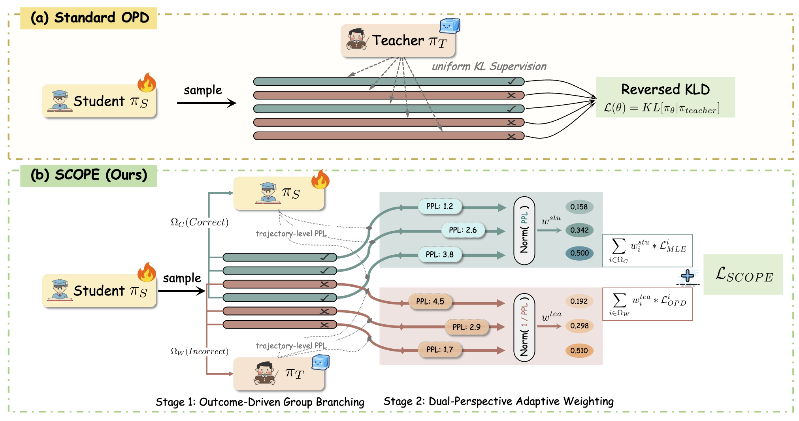

<h1 align="center">
SCOPE: Signal-Calibrated On-Policy Distillation Enhancement with Dual-Path Adaptive Weighting
</h1>

<div align="center">
  <a href='https://arxiv.org/pdf/2604.10688'></a>  &nbsp;
  <a href="https://huggingface.co/papers/2604.10688"></img></a>  &nbsp;
  <a href="https://github.com/machine981/SCOPE"></a> &nbsp;
  <br>
</div>



---

## 🔥 News

- **[2026.04]** SCOPE model weights released on Hugging Face!
  - <a href="https://huggingface.co/Machine981/SCOPE-Qwen3-1.7B"></a>
  - <a href="https://huggingface.co/Machine981/SCOPE-Deepseek-R1-Distill-Qwen-1.5B"></a>
- **[2026.04]** Paper released on arXiv!

## 📖 Overview

On-Policy Distillation (OPD) alleviates alignment gaps by introducing dense, token-level KL supervision from a teacher model, but typically applies this supervision uniformly across all rollouts, ignoring fundamental differences in signal quality.

**Existing OPD Limitations:**
- **Diversity degradation**: Correct paths are reinforced equally, reducing exploration at the capability boundary
- **Rectification inefficiency**: Noisy teacher signals mislead incorrect trajectories

**SCOPE Solution:**
We propose Signal-Calibrated On-Policy Distillation Enhancement (SCOPE), a dual-path adaptive training framework that routes on-policy rollouts by correctness into two complementary supervision paths.

---

## 📝 Abstract

On-Policy Distillation (OPD) alleviates this by introducing dense, token-level KL supervision from a teacher model, but typically applies this supervision uniformly across all rollouts, ignoring fundamental differences in signal quality. We propose Signal-Calibrated On-Policy Distillation Enhancement (SCOPE), a dual-path adaptive training framework that routes on-policy rollouts by correctness into two complementary supervision paths. For incorrect trajectories, SCOPE performs teacher-perplexity-weighted KL distillation to prioritize instances where the teacher demonstrates genuine corrective capability, while down-weighting unreliable guidance. For correct trajectories, it applies student-perplexity-weighted MLE to concentrate reinforcement on low-confidence samples at the capability boundary rather than over-reinforcing already mastered ones. Both paths employ a group-level normalization to adaptively calibrate weight distributions, accounting for the intrinsic difficulty variance across prompts. Extensive experiments on six reasoning benchmarks show that SCOPE achieves an average relative improvement of 11.42% in Avg@32 and 7.30% in Pass@32 over competitive baselines, demonstrating its consistent effectiveness.

---

## 🏆 Key Contributions

- **Empirical analysis of signal quality heterogeneity in OPD:** Uncovers that teacher and student perplexity reliably predict corrective capability on incorrect trajectories and capability-boundary samples on correct ones.

- **The SCOPE dual-path adaptive framework:** Routes rollouts by correctness, directing incorrect trajectories to teacher-perplexity-weighted OPD and correct trajectories to student-perplexity-weighted MLE.

- **Extensive experimental validation:** Achieves 11.42% Avg@32 and 7.30% Pass@32 relative improvement over baselines on six reasoning benchmarks.

---

## 📖 Method

### SCOPE Framework

SCOPE is a dual-path adaptive training framework that routes on-policy rollouts by correctness into two complementary supervision paths:

| Path | Trajectories | Method | Objective |
|------|-------------|--------|-----------|
| **Student Path** | Correct (Ω_c) | Perplexity-weighted MLE | Reinforce unconventional valid paths at capability boundary |
| **Teacher Path** | Incorrect (Ω_w) | Perplexity-weighted KL distillation | Filter out context-induced noise, prioritize reliable guidance |

### Weight Formulation

**Student-guided weight (for correct trajectories Ω_c):**

$$w_i^{stu} = \frac{\text{PPL}_S(y_i|x)^{1/\tau}}{\sum_{j \in \Omega_c} \text{PPL}_S(y_j|x)^{1/\tau}}$$

Amplifies "unconventional valid paths" at the capability boundary using perplexity-based weighting.

**Teacher-guided weight (for incorrect trajectories Ω_w):**

$$w_i^{tea} = \frac{\text{PPL}_T(y_i|x)^{-1/\tau}}{\sum_{j \in \Omega_w} \text{PPL}_T(y_j|x)^{-1/\tau}}$$

Filters "context-induced noise" by down-weighting high teacher perplexity instances.

### Key Insight

Within each prompt's trajectory group, SCOPE applies **group-level perplexity-based normalization** to adaptively calibrate weight distributions, accounting for the intrinsic difficulty variance across prompts.

### Overall Objective

The combined SCOPE objective jointly optimizes:

$$\mathcal{L}_{SCOPE} = \sum_{i \in \Omega_c} w_i^{stu} \cdot \mathcal{L}_{MLE} + \sum_{i \in \Omega_w} w_i^{tea} \cdot \mathcal{L}_{OPD}$$

---

## 📊 Main Results

### Mathematical Reasoning (Teacher: Skywork-OR1-Math-7B → Student: DeepSeek-R1-Distill-Qwen-1.5B)

| Benchmark | Avg@32 | Pass@32 | vs OPD |
| --------- | ------ | ------- | ------ |
| AIME24 | 42.7 | 77.9 | +6.22% |
| AIME25 | 30.4 | 50.9 | +5.19% |
| AMC23 | 80.9 | 97.2 | +6.59% |
| MATH500 | 89.8 | 97.9 | +0.90% |
| Minerva | 37.8 | 55.1 | +8.31% |
| Olympiad | 49.7 | 70.9 | +10.69% |

**Key findings:**
- **11.42%** relative improvement in Avg@32
- **7.30%** relative improvement in Pass@32
- **+5.54%** average improvement over standard OPD across benchmarks

---

## ⚡ Quick Start

### 1. Deploy VLLM Service

```bash
bash deploy_vllm.sh
```

**Key configurations in `deploy_vllm.sh`**:

| Parameter | Description | Default |
| --------- | ----------- | ------- |
| `model_name_or_path` | Model path | `./Models/Skywork-OR1-7B` |
| `served_model_name` | Model name in API | `Skywork-OR1-7B` |
| `--api-key` | API authentication key | `xxx` (must match `verl/utils/api_interface.py`) |

### 2. Configure Experiment Scripts

Set the following in `run_experiment_distill_1_5b.sh`:

```bash
TEACHER_MODEL_NAME=Skywork-OR1-7B  # Must match served_model_name in deploy_vllm.sh
IP_POOL="['xx.xxx.x.xx','...']"    # VLLM service node IP list
```

**API Key Consistency**: The `--api-key` in `deploy_vllm.sh` must match the `api_key` in `verl/utils/api_interface.py`.

### 3. Run Training

```bash
bash run_experiment_distill_1_5b.sh
```

---

## 🔧 Training Parameters

### Model Configuration

| Parameter | Description | Default |
| --------- | ----------- | ------- |
| `POLICY_MODEL_PATH` | Student model path | `DeepSeek-R1-Distill-Qwen-1.5B` |
| `TEACHER_MODEL_NAME` | Teacher model name (as registered in VLLM) | `Skywork-OR1-7B` |
| `IP_POOL` | VLLM service node IP list | `['xx.xxx.x.xx','...']` |

### Data Configuration

| Parameter | Description | Default |
| --------- | ----------- | ------- |
| `TRAIN_DATA` | Training data path | `./verl-distillation-ori/data/deepmath_new/deepmath_new_train.parquet` |
| `VAL_DATA` | Validation data path | `./verl-distillation-ori/data/aime/test.parquet` |
| `MAX_PROMPT_LENGTH` | Max prompt length | `2048` |
| `MAX_RESPONSE_LENGTH` | Max response length | `12288` |

### SCOPE Dual-Path Configuration

| Parameter | Description | Default |
| --------- | ----------- | ------- |
| `USE_SCOPE_DUAL_PATH_WEIGHTING` | Enable SCOPE dual-path weighting | `True` |
| `SCOPE_TAU` | Weight temperature parameter | `1` |
| `SCOPE_USE_SEQ_WEIGHTS` | Use sequence-level weights | `True` |
| `USE_STUDENT_PATH_WEIGHTS` | Use student path weights | `True` |
| `USE_TEACHER_PATH_WEIGHTS` | Use teacher path weights | `True` |
| `STUDENT_PATH_PPL_POSITIVE` | Student path: higher PPL → higher weight | `True` |
| `TEACHER_PATH_PPL_POSITIVE` | Teacher path: higher PPL → lower weight | `False` |

---

## 🤝 Acknowledgements

This work builds upon [verl](https://github.com/volcengine/verl) and the on-policy distillation paradigm, with appreciation for their contributions to the research community.

## 🔗 Citation

If you find our work useful, please consider citing:

```bibtex
@article{scope2026,
  title={SCOPE: Signal-Calibrated On-Policy Distillation Enhancement with Dual-Path Adaptive Weighting},
  author={Zheng, Binbin and Ma, Xing and Liang, Yiheng and Ruan, Jingqing and Fu, Xiaoliang and Lin, Kepeng and Zhu, Benchang and Zeng, Ke and Cai, Xunliang},
  journal={arXiv preprint arXiv:2604.10688},
  year={2026}
}
```

## 📝 License

This project is licensed under the MIT License. See the [LICENSE](LICENSE) file for details.
